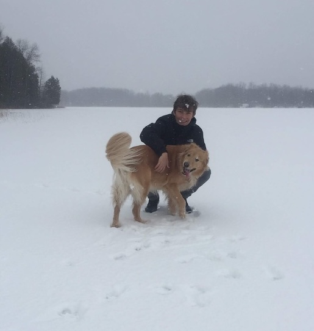
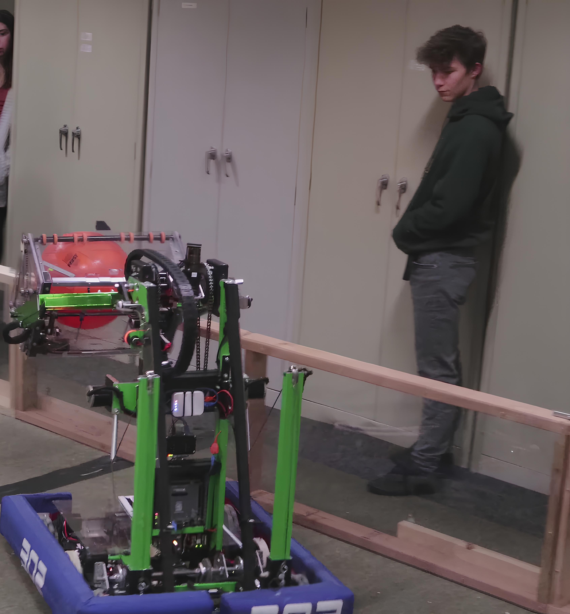
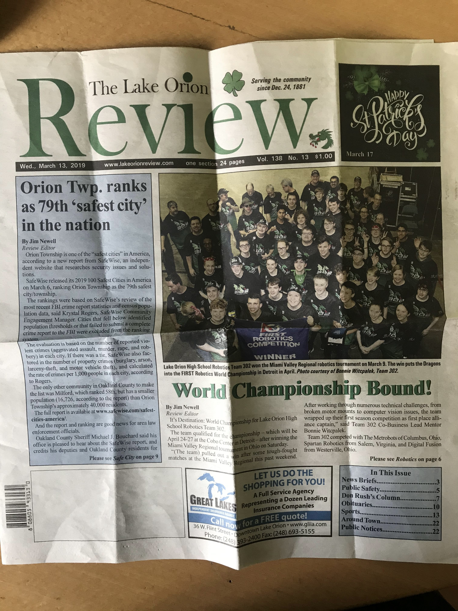
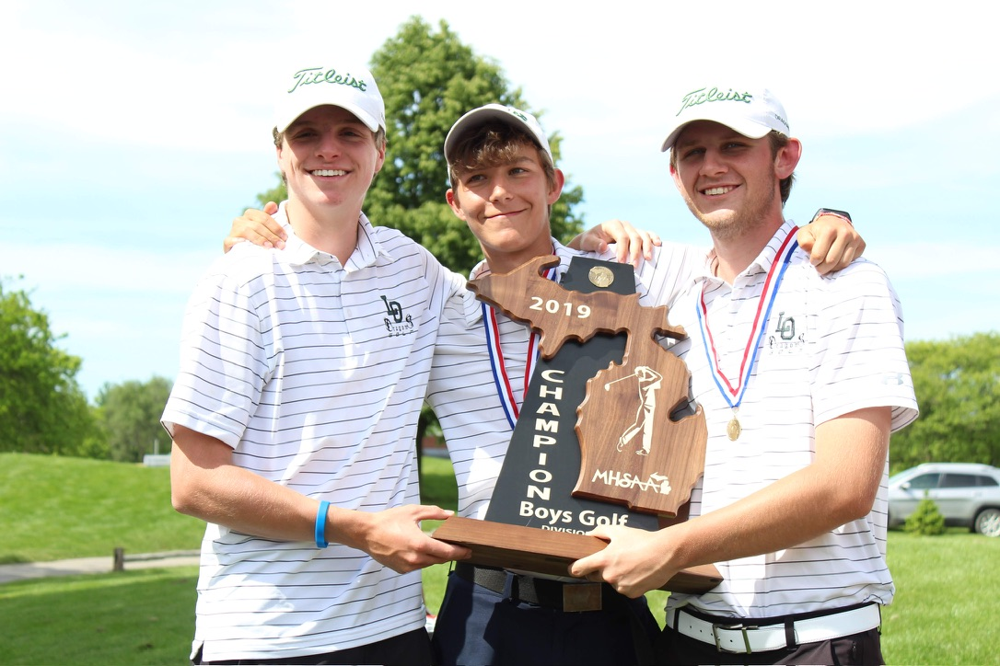
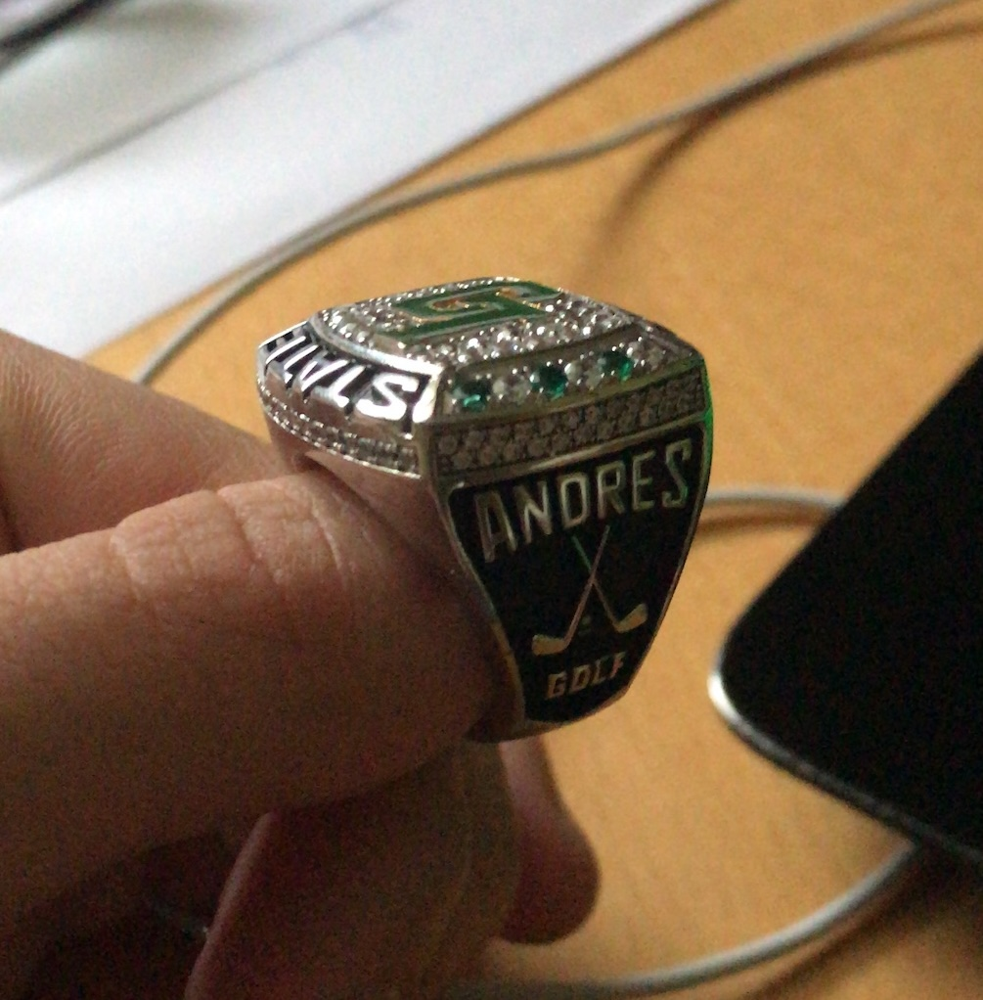
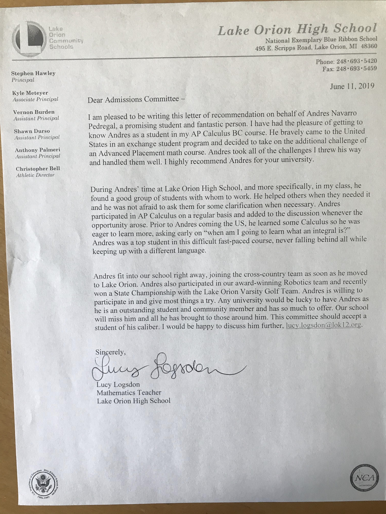
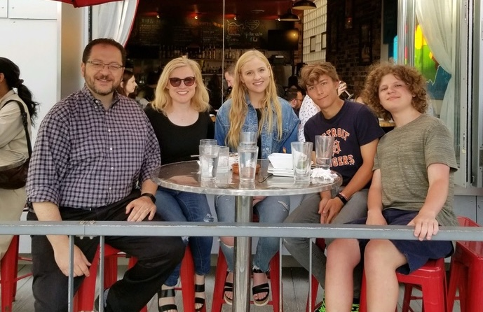

+++
title = "Robots, Entrepreneurship, and Golf Championships: My Exchange Year in the US"
description = "I spent a year as an exchange student in the US, where I learned about robotics, entrepreneurship, and golf championships."
date = 2024-01-08
+++

It was August 2018, after only 15 years in this world, when I left home to spend a year as an exchange student in the United States. 

Right from the start, I knew it would be an unforgettable experience. I would live with a host family, attend an American high school, and learn about a new culture.

And learn English, of course.

So here are the key moments of my exchange year in the US.

## Robotics

The summer before my exchange year, I bought my first soldering iron. With it, I started self-teaching myself electronics and low-level programming.

With this excitement, I was looking forward to joining the robotics team at my high school, Team 302. 

We didn't just build robots; we built one-meter tall robots for the [FIRST Robotics Competition 2019](https://www.youtube.com/watch?v=8BH8SyTlZCQ)!

After a lot of work, we won the state and Regional Championships and qualified for the World Championship in Detroit.

This experience taught me the importance of teamwork, collaboration, and surrounding yourself with people who share your passion.

## Entrepreneurship

During the cold winter, freezing for a Spaniard, I started a small business creating websites and mobile apps online.

I used Fiverr and Upwork to find clients and started working on small projects.

You can find more information in this post, "[What did I learn from freelancing at 16](/posts/what_did_i_learned_from_freelancing_at_16/)".

## Golf Championships

Finally, as I was also pretty good at golf back in Spain, I went to join the varsity golf team at my high school.

After a lot of training, cold mornings, and tournaments, we won the State Championships!

It was the first time in the history of the school that the golf team won the State Championships.

And if you know anything about the US and sports...

## Education

Finally, many people say that the US Education system is quite easy compared to Spain's. I agree.

However, if you take hard classes, such as AP Physics and AP Calculus, you can learn a lot.

I was even able to take quite interesting classes, such as Auto Repair!

## Conclusion

All in all, the exchange year in the US was an unforgettable experience that taught me many valuable lessons.

I cannot thank my host family enough for all the support and help they gave me during this year.

