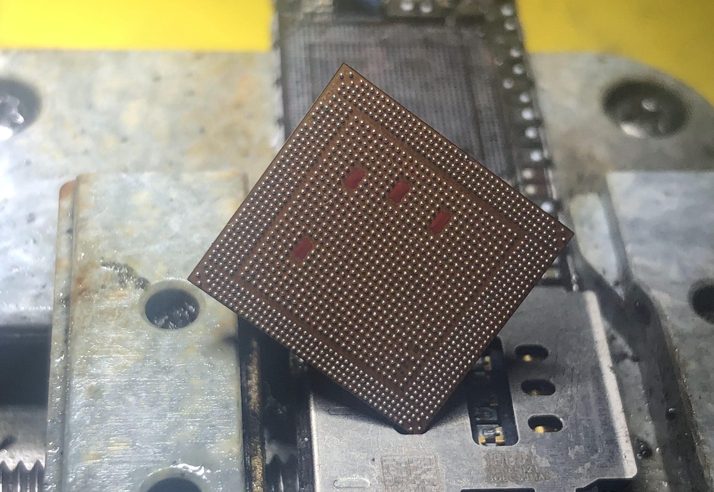

+++
title = "From taking apart microwaves to fixing a thousand phones"
date = 2024-03-19
+++

Remember those moments as a kid when you couldn't resist taking apart your toys to see what was inside?

Well, that was me at 14, a curious teenager armed with a soldering iron, burned fingertips, and driving my mom crazy as I dismantled everything I got my hands on.

In this post, I want to share my experience of how I fixed over a thousand phones between the ages of 17 and 19.

## The Spark That Ignited My Journey

At 16, I was fortunate to spend one year in the US, where I joined a robotics team (yes, I am a nerd).

During this time, I was in charge of the design and manufacturing of the whole electric plant of a 1-meter-tall robot.



Here, I learned about electronics and how to debug and diagnose problems.

Therefore, when I returned home, I started fixing phones around my town. And with crapy ads in a second-hand selling app, I promoted my services.

## Moving Forward

After a couple of hundred devices, I mastered basic repairs. However, more and more people kept asking me if I fixed motherboards.

Therefore, I set up a microsoldering lab and started learning how to diagnose problems. With a lot of mistakes, for sure!

From replacing chips to swapping CPUs, I honed my skills in motherboard repairs and problem-solving.

As my reputation grew, I started gaining more and more traction. I expanded my clientele when word of mouth started spreading.

At the beginning of the year, I averaged 7 to 10 motherboards weekly.

## Why I Decided to Shift Gears {#why-i-decided-to-shift-gears}

At 18, I started my Dual Bachelor in Data Science and Engineering and Telecommunication Engineering.

After two years of fixing thousands of devices, I was at a crossroads. Balancing this freelance career with my undergraduate studies became increasingly challenging.

Moreover, the work I did became repetitive. What was once a hobby that I loved as I was learning every day was now a monotonous task.

While maintaining a modest workload, my focus shifted toward the Cloud and DevOps. The main reason was that I found new challenges and subjects to learn.

## Insights and Main Takeaways

In this adventure, I gained experience in multiple disciplines, from electronics to business and selling.

From the technical point of view, what I took home was:

-   Self-learning and problem-solving are highly valuable. In this world, the bigger the problems you can solve, the higher you will be valued.
-   Problems that are difficult to replicate are the hardest to diagnose and troubleshoot.
-   Being able to adapt to new situations quickly is the cornerstone of survival.
-   Understand complex systems, how they work, and distill to their essence.

Talking to a lot of different people, I learned that:

-   Being an extrovert is a skill. You have only to be willing to confront undesirable situations.
-   Rejection and failure are the only paths to a YES. Face the fear of being rejected and always try new things.
-   Complex topics are explained best with analogies that people experience in their day-to-day lives.

And finally, this entrepreneurial attempt has shown me that:

-   An exceptional service is way better than any marketing or promotion. Word of mouth is the only way.
-   Don't lower the price. Instead, provide more value to the customer.
-   Selling is a skill worth mastering. You either sell yourself or get sold.
-   Always ask for feedback to keep improving the service. There is always room for improvement.


  
  
  
  
  
  
  
  
  
  
  
  
  
  
  
  
  
  
  
  
  


## Closing Thoughts {#closing-thoughts}

All in all, I have enjoyed the journey. I will keep fixing some devices, but it will not be my main focus.

From now on, my main focus will be pursuing a career in Cloud and Solutions Architecture. It is the place where I can learn the most.
