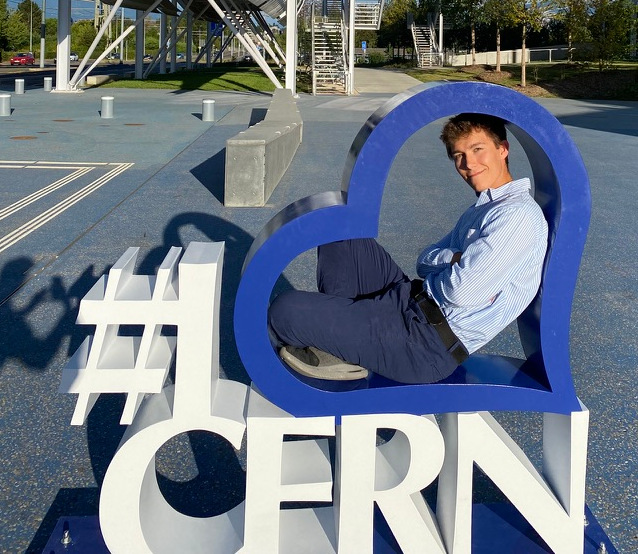
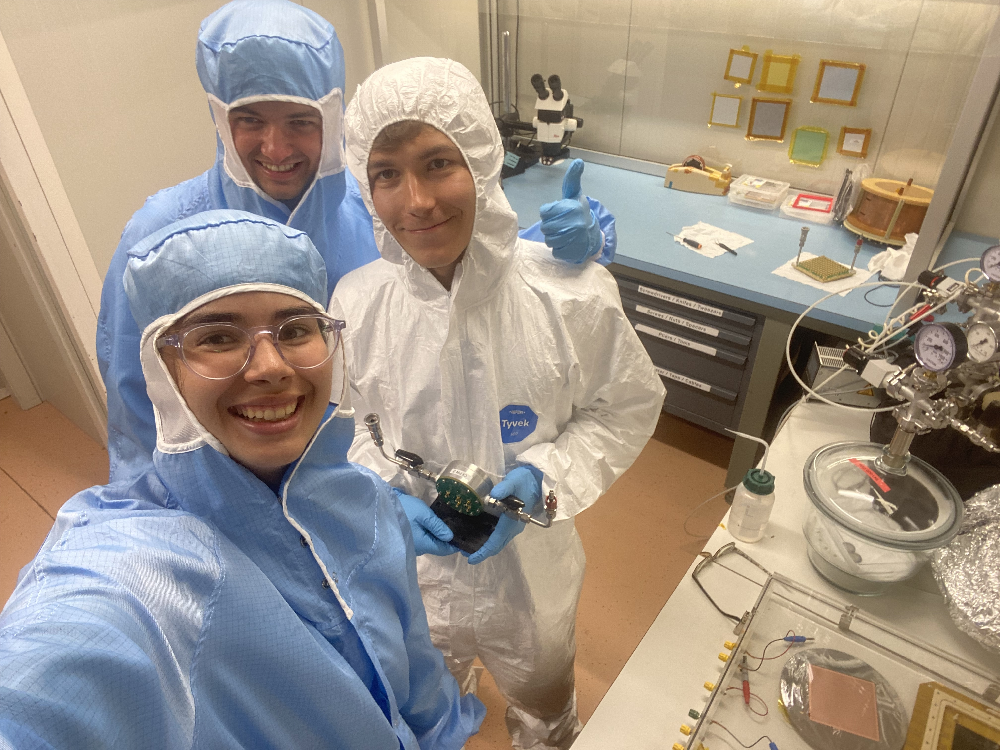
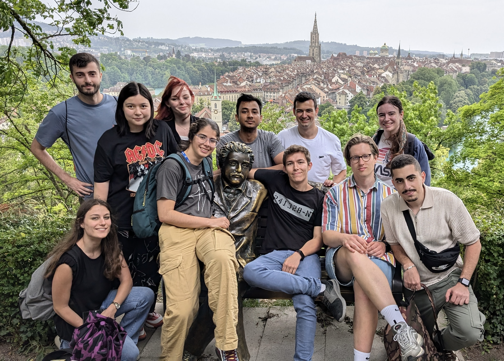

+++
title = "My experience at CERN, from tiny particles to enormous experiments"
description = "I spent a few months as a Summer Student at CERN gaining valuable experience in particle physics, software engineering, and data analysis."
date = 2024-09-08
+++

I have been fortunate to spend the last few months working as a Summer Student at [CERN](https://home.cern/), the European Organization for Nuclear Research, where I did everything from learning about particle physics, working with excellent scientists and colleagues, or traveling around Switzerland.

Honestly, it has been an incredible experience. Here, I will share my experience at CERN and the key insights I have gained.

## Introduction

First, let me give you a brief overview of CERN and the work that goes on there.

CERN is the world's largest particle physics laboratory. It is home to the Large Hadron Collider (LHC), the world's most powerful particle accelerator.

The scope of research at CERN is vast, and it covers a wide range of topics, from the study of elementary particles to the origin of the universe, radioisotopes, and even cloud formations!
It is honestly mind-blowing.

## Project I worked

During my time at CERN, I worked on the [EP-DT-FD Gas Team](https://ep-dep-dt.web.cern.ch/gas-systems) under the supervision of [Gianluca Rigoletti](https://www.linkedin.com/in/gianlucarigoletti) on a project related to Resistive Plate Chambers (RPCs).

RPCs are detectors used in high-energy physics experiments to detect particles produced in collisions, usually muons.
However, the current problem with these detectors is that the gas mixtures used are not environmentally friendly.

My work involved developing tools to analyze and improve the current software used to study the performance of RPCs with alternative gases.

You can find more information in the [following paper](https://cds.cern.ch/record/2908492?ln=en).

## Experience and insights

While I have learned and grown in many ways at CERN, here are some key insights I have gained that I believe are worth sharing.

### Exposure to cutting-edge research and technology

Working at CERN has exposed me to state-of-the-art technologies and innovative approaches in computing and data management.

I have learned about data acquisition and processing, signal analysis, and software engineering, which has broadened my knowledge in areas in which I did not have any prior experience.

Moreover, I have had the opportunity to work with experts in the field, where I learned how to approach complex problems and develop solutions.

### Collaboration in a Multidisciplinary Environment

Having met and worked with more than a hundred researchers, engineers, and scientists from various fields worldwide, I have learned the importance of collaboration in a multidisciplinary and multicultural environment.

I have learned how to communicate effectively with people from different backgrounds, work in a team, and leverage the diverse expertise of my colleagues to achieve common goals.

Moreover, I have learned how to adapt to different working styles and cultures, which has been a valuable experience.

Side note: I have never seen so many amazing people in one place. The passion, dedication, and expertise of the people at CERN are truly inspiring.

### Independent Research and initiative

At CERN, as you usually work on a cutting-edge project, you need to take the initiative and drive parts of the research independently.

Here, I have learned how to do experiments and the scientific process, which is more difficult than we are taught at university (from an engineering standpoint).

Moreover, I have learned how to manage my time effectively, set goals, and work towards achieving them.

### Impact and results 

One of the most rewarding aspects of my time at CERN has been seeing the impact of my work.

By developing software tools to analyze the performance of RPCs with alternative gases, I have contributed to the ongoing research at CERN and helped improve the efficiency of the detectors.

Moreover, I have learned how to present my work effectively, write technical reports, and communicate my results to a broader audience.

### Technical proficiency and learning agility 

In only three months, I have gained a lot of technical skills and knowledge in different areas like particle physics, software development, and data analysis.

The fast-paced environment at CERN has pushed me to learn quickly, adapt to new technologies, and develop my skills in a short period.

However, the most significant outcome has been the importance of taking notes and writing about my experiences. It is a great way to reflect on the learning and have a track record of your thoughts. This site is my way of doing that.

## Conclusion 

The time spent at CERN has been beyond incredible. I am grateful for the opportunity to work with such talented people and contribute to cutting-edge research.

The people I have met, the things I have learned, and the experiences I have gained will stay with me for a long time.

I want to thank my supervisor Gianluca Rigoletti. He has been a great mentor and has helped me grow both professionally and personally.

If you are interested in science, technology, and innovation, consider applying for a position at CERN. It is a unique opportunity to work on groundbreaking research and contribute to the advancement of science.
