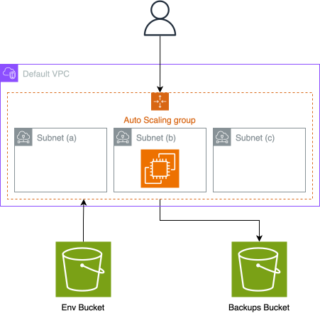

+++
title = "Tracking Finances on a Budget: Deploying Actual Budget with AWS CDK"
description = ""
date = 2024-12-11
+++

Are you tired of living in the rain financially? Do you want to know where every penny goes without breaking the bank by setting up a budgeting tool? Well, you are in luck! I deployed a self-hosted budgeting tool, [Actual Budget](https://actualbudget.org/), using [AWS CDK](https://aws.amazon.com/cdk/) for **FREE**.

## The Goal: Cheapest Deployment Possible

My goal was to set up a deployment that was easy to manage and cost-effective. My requirements were:

- Use only necessary resources and AWS Free Tier.
- No fuss deployment and maintenance with self-signing SSL certificates
- Automatic backups and failover for data safety and availability
- A chance to learn and compare AWS CDK with Terraform

## The Tools Used

The tools I used for this project were:

- **AWS** – My cloud provider of choice as I am a [certified professional](posts/how_i_passed_the_aws_solutions_architect_professional_certification/), I guess...
- **AWS CDK (Cloud Development Kit)** – IaaC using familiar programming languages like TypeScript, Python, and Java. I usually use Terraform, but I wanted to try this one.
- **Actual Budget** – Self-hosted budgeting tool that lets you track expenses and income. The best part is that it is open-source, so you have control over your data.
- **Docker** – Think of it as a lightweight, portable, and isolated environment for your app. If you want to deploy anything in the cloud, Docker is a great place to start.

## The Infrastructure Blueprint

To achieve my goal of a cheap and efficient deployment, I designed the following architecture:

AWS architecture of the deployment

- **EC2 instances with Auto Scaling Group** – Tiny t2.micro EC2 instances that can be easily spun up in case of problems.
- **S3 Buckets** – Store application data and backups, just in case!
- **Default VPC** – No need to create a new VPC for our EC2 instances for this use case, but if you want to use it in production, read the last part of the article.
- **Docker Compose and Nginx** – We'll use Docker Compose to deploy the app and Nginx to handle HTTPS requests and auto-manage SSL keys. Check out [valian/docker-nginx-auto-ssl](https://github.com/Valian/docker-nginx-auto-ssl).
- **IAM Roles and Policies** – Follow the least-privilege permissions.

You can check out my [GitHub repo](https://github.com/andres-nav/actual-budget-aws-cdk) to see the full deployment and the steps to deploy it yourself.

The total cost of the architecture is [$6.03 per month](https://calculator.aws/#/estimate?id=c8eb0389b5d63799e56afbdd2b6e5698cee82db8), but the free tier is cheaper at $0 :)

## Things to take in mind...

After running this deployment for a month, I am thrilled to report that I have had zero issues, surprisingly!

As I continue to refine my setup, I recommend different features to follow more in the Well-Architected Framework:

- **Automate DNS with Route 53** – Simplify the DNS management and automate the IP hand-over when failures occur. You can also use an elastic Public IP and a load balancer, but that is EXPENSIVE.
- **Separate Nginx and Application Containers** – Use a public EC2 instance for Nginx and a private one for Actual Budget.
- **Use Elastic File System (EFS)** – Implement shared storage for data across multiple EC2 instances with EFS volumes so the application can scale horizontally (Probably an overkill).
- **Set Up Monitoring and Alerts with CloudWatch** – Proactively monitor system health and resource usage and add alarms if errors occur.
- **Use a t4g.nano Instance** – I went for the usual t2.micro to take advantage of the Free Tier pass this year, but you can use the t4g.nano as it is 60% cheaper on average and good for the job.

## Summary

In this article, I shared how I deployed the Actual Budget self-hosted budgeting tool on AWS using AWS CDK. It is a perfect example of deploying a basic application in the Cloud with EC2, S3, Docker, and Nginx. You can eaily use for other projects.

Head to my [GitHub repo](https://github.com/andres-nav/actual-budget-aws-cdk) to see the source code and the steps to deploy it yourself.
