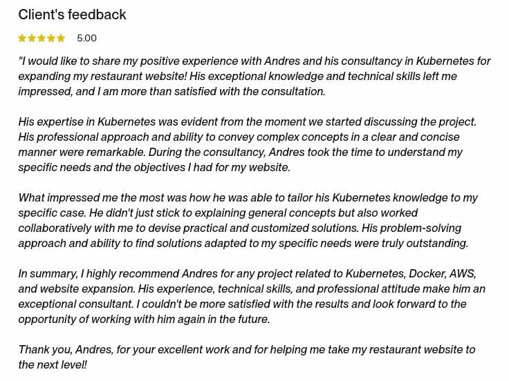

+++
title = "What did I learn from freelancing at 16"
date = 2024-07-05
+++

Imagine this: a curious 16-year-old passionate about business and entrepreneurship with a basic understanding of programming. That was me.

In this post, I want to share my experience freelancing at 16: the challenges I faced and the lessons I learned along the way.

## How It All Started

It was 2018, and I was spending a year in Michigan. I had a basic understanding of programming and a passion for building apps and websites. So, I decided to try my hand at freelancing.

Finding clients was difficult at first. Who would trust a 16-year-old with their business needs? Probably not, right?

I began by working on small projects for university students, helping with their assignments, and creating small websites for local businesses. For example, my first project was a simple Scratch program. You have to start somewhere, right?

As I gained more experience and built a portfolio, I started attracting more clients and working on larger projects. I even made a survey app for an NGO in South America!

Eventually, I had a steady stream of clients and projects. For example, I created a website for a local vet clinic, a restaurant, and even a full presentation app for a water company in the USA.

## The challenges I faced

Freelancing at 16 came with its fair share of challenges. Here are a few I encountered and how I overcame them:

### Lack of Experience

As a teenager, I lacked the experience and knowledge of running a business. I did not know how to promote my services, deal with clients, or negotiate prices.

While I had a good grasp of programming, I had to learn to communicate effectively with clients, understand their needs, and deliver solutions that met their expectations.

**The best way to overcome inexperience is by doing the work**. After a few projects, I started understanding my client's needs and delivering solutions that met their expectations.

### Importance of Trust and Personal Brand

As a 16-year-old, building trust with clients was not easy. How could they trust me with their projects when I did not have a track record or degree? And because I was young, some clients doubted my skills and professionalism.

I had to work extra hard to prove my skills, deliver high-quality work, and build a reputation for reliability and professionalism.

**By building a portfolio of projects and collecting testimonials from satisfied clients, I was able to build trust and establish a personal brand**.

TIP: Offer your services for free initially to build a portfolio and gain testimonials. This helps attract more clients and build trust.

### Dealing with Setbacks 

I lost count of the times I made mistakes, had clients ghost me, was underpaid, or had projects not go as planned.

However, I learned to take setbacks in stride, own up to my mistakes, and find solutions to overcome challenges.

**The best way to deal with setbacks is to learn from them and keep moving forward.**

### Not All Customers Are Good Customers 

I learned the hard way that not all customers are good customers. Some clients will try to take advantage of you, pay less than agreed, or ask for more work than initially planned. Some might not pay at all.

Set clear boundaries, have a contract, and be prepared to walk away if the client does not respect the agreement.

**It is better to have no clients than bad clients.** Bad clients will drain your energy, time, and resources, and will not help you grow your business.

Be picky with your clients.

### Not Asking for Feedback 

I made the mistake of not asking for feedback from clients. I thought that if they were happy with my work, they would tell me. But that was not always the case.

Feedback is crucial in freelancing. It helps you understand what you are doing well and what you need to improve, so you grow as a professional and deliver better results to your clients.

**Always ask for feedback and be open to suggestions for improvement.**



### Assuming I Knew What the Client Wanted 

At first, I often assumed that what clients said was what they wanted. But that was not always true.

After a few projects, I learned the importance of asking questions and clarifying doubts to better understand what the client wanted before starting the project.

Set clear and measurable goals with your clients before starting. This helps you understand their needs and deliver solutions that meet their expectations.

TIP: **Set clear expectations that you can meet and aim to over-deliver.** When you over-deliver, clients are happy and more likely to recommend your services to others.

## Why I Stopped {#why-i-stopped}

Freelancing is a great way to gain experience, build a portfolio, and earn extra income.
However, it is also time-consuming as you have to manage everything from client communication to project delivery.

When I started university and pursued another side hustle, balancing freelancing with my other commitments became challenging.
So, I decided to take a break from freelancing and focus on my studies and other projects.

## Conclusions {#conclusions}

All things considered, this experience has taught me valuable lessons that I still apply today. It helped me develop my problem-solving and communication skills and taught me the importance of delivering results and building trust.

If you are considering freelancing, I encourage you to try it. It is a great way to learn new skills, build a portfolio, and gain valuable experience.

Feel free to reach out [via Linkedin](https://www.linkedin.com/in/andresnav/) and connect with me. I am always open to new opportunities and collaborations.

Remember, the journey is hard, but the lessons you learn are priceless.
